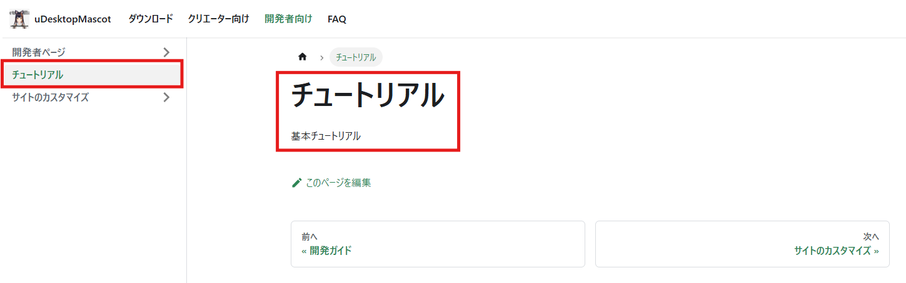
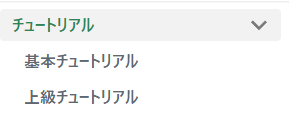

# ページの追加方法

## ページの作成

- ページは、マークダウン形式で記載します。
- 今回は例として、開発者向けページにチュートリアルページを作成してみます。
- 開発者向けページと、クリエーター向けページのそれぞれの配置パスは以下の通りです。
  - クリエーター向けページ：`docs/cteator`
  - 開発者向けページ：`docs/developer`
- `docs/cteator`に、`tutorial.md`を作成します。
- 以下のフォーマットに従って記事を作成してください。`title`を含めた以下のヘッダーを記載します。
  - `title`：記事のタイトルです

```
---
title: チュートリアル
---

基本チュートリアル

```

- 「開発者向けページ」に、チュートリアルページが作成できていますね！



## 複数ページを一つのセクションにまとめたい場合

- 例えば、「チュートリアル」というセクションを作って、その中にページを配置したい場合を考えます。
- 以下の画像のように、「チュートリアル」セクションに、「基本チュートリアル」と「上級チュートリアル」を配置します。



### 作成方法

- `docs/creater` に任意のフォルダを作成（例：`docs/creater/tutorial`
- 以下のコードが記載された`_category_.json`ファイルを追加します。
  `_category_.json`の`label`は、セクションのタイトル、`description`は説明になります。

```
{
  "label": "チュートリアル,
  "position": 1,
  "link": {
    "type": "generated-index",
    "description": "基本チュートリアルと、上級キューとリアルを実施しましょう！"
  }
}
```

- 「基本チュートリアル」`basic-tutorial.md`を、`docs/creater/tutorial`に配置します。
- 「上級チュートリアル」`advanced-tutorial.md`を、`docs/creater/tutorial`に配置します。
